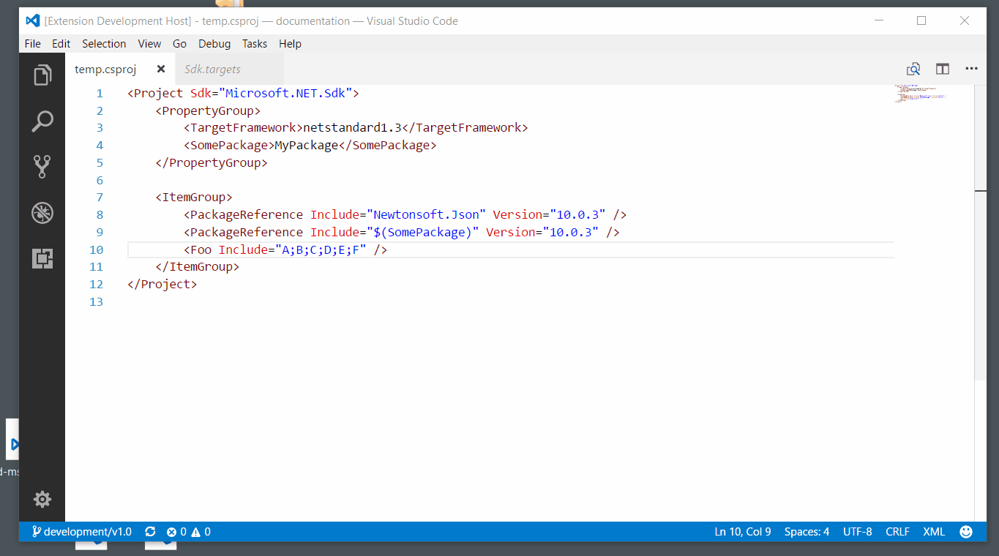
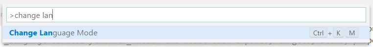
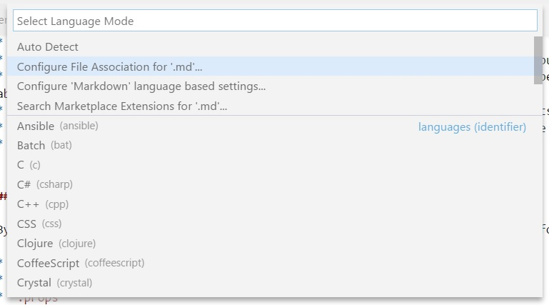

# MSBuild project file tools

An extension for VS Code that provides intellisense for MSBuild project files, including auto-complete for `<PackageReference>` elements.

The language service used by this extension can be found here: [tintoy/msbuild-project-tools-server](https://github.com/tintoy/msbuild-project-tools-server/)

**Note**: there are features in the extension (marked "language service feature" below) that use an out-of-process language service; this is enabled by default but if all you want is `PackageReference` completion, you can disable the language service by setting `msbuildProjectTools.language.enable` to `false` in your VSCode preferences. You will need to reload VSCode after changing this setting.

You need the .NET Core runtime v3.0.0 (or SDK v3.0.1xx) or newer installed to use the language service (but your projects can target any version you have installed).

## Usage

* Completions for `PackageReference` and `DotNetCliToolReference`.
  * Completions for `Include` and `Version` attributes of these items (invoke the `NuGet: toggle pre-release` command to include / exclude pre-release packages / package versions).
  * _Language service feature:_ Completions to create these elements.
* _Language service feature:_ Completions for common top-level elements (e.g. `PropertyGroup`, `ItemGroup`, `Target`).
* _Language service feature:_ Completions for import elements.
* _Language service feature:_ Completions for property elements.
* _Language service feature:_ Completions for item elements.
* _Language service feature:_ Completions for common item attributes.
* _Language service feature:_ Completions for common property `Condition` attributes.
* _Language service feature:_ Hover the mouse over imports, targets, items, properties, and conditions to see information about them.
* _Language service feature:_ Document symbols are supported for imports, targets, items, and properties.
* _Language service feature:_ Go-to-definition is implemented for both SDK-style and regular project imports.
* Basic syntax highlighting of MSBuild expressions in attribute values.  
  To see this highlighting, change the editor language from `XML` to `MSBuild`.
* _Language service feature:_ Completions for `$()` property, `@()` item, and `%()` item metadata expressions.  
  To enable these completions, ensure that the editor language is `MSBuild` (not `XML`).
* _Language service feature:_ Completions for task elements and attributes based on metadata for tasks declared in the project and its imported projects.  
  To enable these completions, add the string `Tasks` to the `msbuildProjectTools.language.completionsFromProject` setting.
* Useful snippets for common elements of MSBuild project XML (added by @doggy8088).  
  To use these snippets, ensure that the editor language is `MSBuild` (not `XML`).

### File extensions

By default, the language service is automatically available for files with the following extensions:

* `*.*proj`
* `.targets`
* `.props`
* `.tasks`

If you want to use it with additional file types:

1. Open the desired file.
2. Change the language mode by pressing `Ctrl-Shift-P` (or `Cmd-Shift-P` on Mac) and choosing "Change Language Mode".  
   
3. Choose "configure file association".  
   
4. Choose language `MSBuild`.

## Installation

You can install this extension from the [VS marketplace](https://marketplace.visualstudio.com/items?itemName=tintoy.msbuild-project-tools), or simply [download](https://github.com/tintoy/msbuild-project-tools-vscode/releases/latest) the VSIX package for the latest release and install it by choosing "Install from VSIX" from the menu on the top right of the extensions panel.

## Building from source

See [BUILDING.md](docs/BUILDING.md).

## Design

See [architectural overview](docs/architecture/overview.md) for details (this is a work-in-progress; if you have questions, feel free to create an issue).

## Limitations

* The VS Code extension API has changed somewhat since this extension was first created, and some features (such as hyperlinks to files in hover tooltips) are only partially functional at present (broken by VS Code API / behaviour changes).  
  _This is being worked on :-)_
* Limited intellisense is available for dynamic `PropertyGroup` / `ItemGroup` declarations (i.e. those appearing inside a `Target` element); these are only evaluated when the project is built and so very little information about them is available to us when statically evaluating the project (see [tintoy/msbuild-project-tools-server#5](https://github.com/tintoy/msbuild-project-tools-server/issues/5#issuecomment-383352512) for details).
* Support for task completions is experimental; if you find a problem with it, please [create an issue](https://github.com/tintoy/msbuild-project-tools-vscode/issues/new).
* If you open more than one project at a time (or navigate to imported projects), subsequent projects will be loaded into the same MSBuild project collection as the first project. Once you have closed the last project file, the next project file you open will become the master project. The master project will become selectable in a later release.

## Questions / bug reports

If you have questions, feedback, feature requests, or would like to report a bug, please feel free to reach out by creating an issue. When reporting a bug, please try to include as much information as possible about what you were doing at the time, what you expected to happen, and what actually happened.

If you're interested in collaborating that'd be great, too :-)
