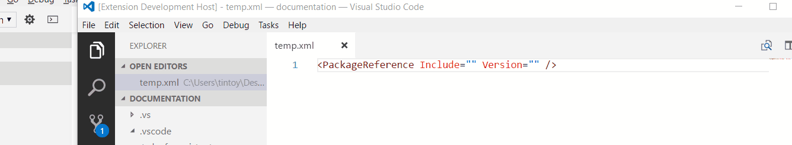

# MSBuild project file tools

An extension for VS Code that provides auto-complete when editing `<PackageReference>` elements MSBuild project files.

**Note**: this is an experimental version of the extension that uses an out-of-process language server using Microsoft's Language Server Protocol. It is functional but is not yet ready for production use.

## Usage

* When you're editing your project file, type `pr` then press `tab` to insert a `PackageReference` element.
* Move to the `Include` or `Version` attribute of your `PackageReference` element and press `ctrl+space` to bring up a list of package Ids / versions.
* Hover the mouse over targets, items, and properties to see information about them.
* Go-to-definition is implemented for both SDK-style and regular project imports.
* Document symbols are supported for imports, targets, items, and properties.

## Installation

To install this extension, [download](https://github.com/tintoy/msbuild-project-tools-vscode/releases/) the VSIX package for the latest experimental release and install it by choosing "Install from VSIX" from the menu on the top right of the extensions panel.

## Limitations

* This extension uses the NuGet v3 API to resolve package names and versions. The API is pretty slow, unfortunately; I'll try to improve performance / result caching in the next release.
* At present the extension only works on project files (`*.*proj`) and although it does process any `.targets` / `.props` files they include, it doesn't provide intellisense inside those files (this is mainly because VS Code doesn't make it easy to keep track of which project a given `.props` file was opened for). This aspect of the design needs further analysis, I think.

## Questions / bug reports

If you have questions, feature requests, or would like to report a bug, please feel free to reach out by creating an issue. When reporting a bug, please try to include as much information as possible about what you were doing at the time, what you expected to happen, and what actually happened.

If you're interested in collaborating that'd be great, too :-)
