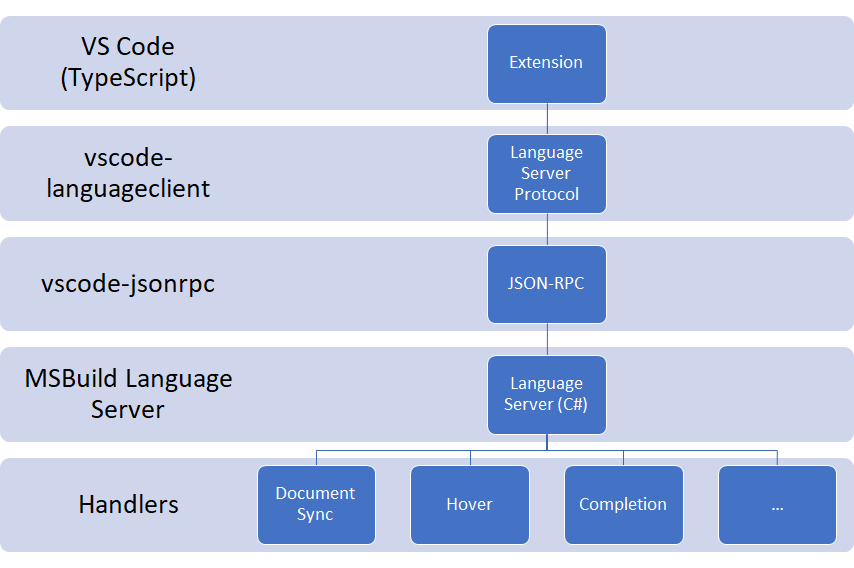
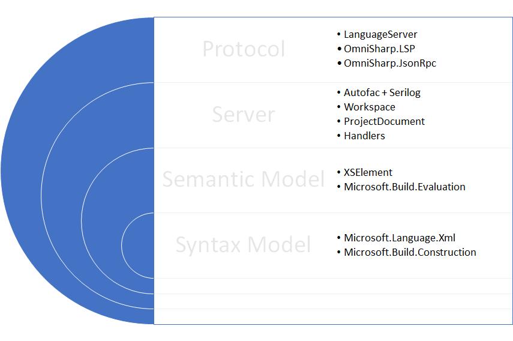

# Architectural overview

Most of the functionality provided by MSBuild project tools is implemented by an LSP-compliant language service.

_Note: this documentation is a work-in-progress; if you have questions, feel free to create an issue._

# Language Server Protocol

The extension for VS Code extension communicates with this service using [vscode-languageclient](https://www.npmjs.com/package/vscode-languageclient) over STDIN/STDOUT.

# Server

The server is implemented in several layers.

* **Protocol**
  * We use OmniSharp's LSP and JSON-RPC implementation.
  * Everything is tied together by the [LanguageServer](https://github.com/OmniSharp/csharp-language-server-protocol/blob/4bc2a15e43593e6e459e9b0784cb85fadcf89c34/src/Lsp/LanguageServer.cs#L22).
* **Server**
  * We use Autofac for dependency-injection and Serilog for logging (including a custom logger that forwards log entries to the LSP client, e.g. VS Code, for diplay).
  * A [Workspace](../../src/LanguageServer.Engine/Documents/Workspace.cs) handles all projects for a given base directory.
  * Most of the state for each open MSBuild project is held by a [ProjectDocument](../../src/LanguageServer.Engine/Documents/ProjectDocument.cs) (see [MasterProjectDocument](../../src/LanguageServer.Engine/Documents/MasterProjectDocument.cs) and [SubProjectDocument](../../src/LanguageServer.Engine/Documents/SubProjectDocument.cs) for further details).
    * Document state is protected by an `AsyncReaderWriterLock` (it is the caller's responsibility to call `XXXLock` / `XXXLockAsync` as required).
* **Handlers**
  * The [DocumentSyncHandler](../../src/LanguageServer.Engine/Handlers/DocumentSyncHandler.cs) handles synchronisation of document state with the client. We expect a `textDocument/didOpen` notification as the trigger to open and load a project.
  * The [CompletionHandler](../../src/LanguageServer.Engine/Handlers/CompletionHandler.cs) calls multiple [completion providers](../../src/LanguageServer.Engine/CompletionProviders) in parallel.
    * If all completion providers return `null`, then the `CompletionHandler` will return null to the caller (indicating no completions are available).
    * If only _some_ completion providers return `null`, then the `CompletionHandler` will ignore them and return non-`null` completions.
    * If any provider indicates that their completion list is incomplete, then the composite completion list will be marked as incomplete.

